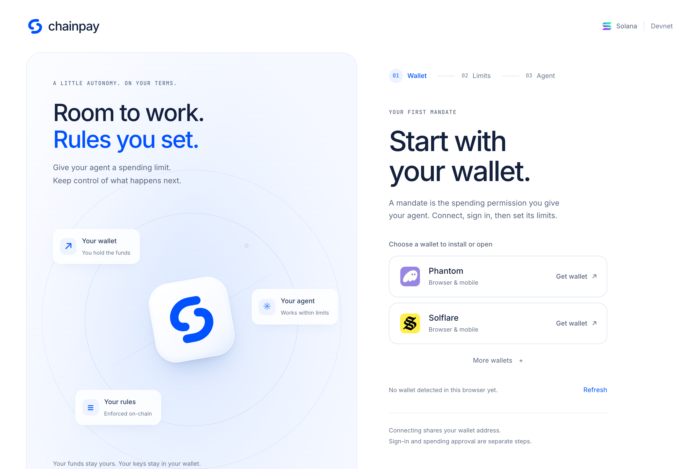

<p align="center">
  
</p>

<h1 align="center">ChainPay</h1>

<p align="center"><strong>Give agents spending limits. Keep control of your funds.</strong></p>

ChainPay lets you give an AI agent permission to make stablecoin payments on
Solana within limits you approve. The on-chain program checks each payment
and creates a receipt you can inspect and share.

**[Try ChainPay](https://chainpay-frontend.onrender.com/)** ·
[First payment walkthrough](docs/getting-started/try-chainpay.md) ·
[Connect an agent](docs/guides/connect-an-agent.md) ·
[Documentation](docs/README.md)

**Devnet demo.** This is a test-network project, not a mainnet payment service.
These docs describe this fork's PR stack. The hosted app currently shows an
earlier interface. [Run this fork locally](docs/getting-started/local-development.md)
for the onboarding shown below.



*Actual owner setup in this fork. No wallet connected; no sample payments or balances.*

## How it works

A **mandate** is your on-chain spending permission: which agent can pay,
which token it can spend, how much it can spend, and when permission expires.
Your tokens stay in your token account until a permitted payment transfers them.

**You approve limits** → **Agent requests payment** → **Solana checks the rules** → **Receipt**

For example, you could allow an agent to spend up to 1 token per request,
with a total allowance of 5 tokens. A request for 2 tokens exceeds that
per-payment limit and is rejected. These numbers are illustrative, not a
preconfigured or funded demo.

**Human approval mode** asks you to sign each payment. **Delegated mode** uses
an approved external signer within your limits; its live provider setup and
settlement acceptance are still pending. Connecting a wallet or signing in
does not authorize a payment.

## Try your first payment

Use a Devnet wallet with Devnet SOL for fees and a supported Devnet token
balance. Start with human approval mode.

1. **Connect and sign in.** Open the app, connect your wallet, and explicitly
   sign the login message. This proves wallet ownership.
2. **Set spending limits.** Choose **Approve each payment**, set limits and
   expiry, and select **Prepare token account**. Review the mandate before
   approving its creation in your wallet.
3. **Review a payment.** In Payments, choose the mandate and enter a reference,
   amount, and **Recipient wallet address** whose token account already exists.
   Select **Prepare payment**, review the details, then **Approve payment**.
4. **Inspect the receipt.** After finalized settlement, copy **Receipt PDA**.
   In **Receipts**, paste it under **Receipt address** and select **Verify**.
   Open the card's **Public receipt** link to inspect and share it.

**[Follow the complete walkthrough →](docs/getting-started/try-chainpay.md)**
It explains funding, approvals, expected results, and what to do if a payment
is still waiting.

## Build with ChainPay

| I want to… | Start here |
| --- | --- |
| Connect an AI agent | [MCP connection guide](docs/guides/connect-an-agent.md) — discover tools, authenticate, and inspect a mandate |
| Integrate a TypeScript app | [SDK guide](docs/guides/use-the-sdk.md) — build locally and read protocol state |
| Accept payment for a resource | [Merchant guide](docs/guides/merchant-integration.md) — verify payment before serving it |
| Run or contribute to the project | [Local development](docs/getting-started/local-development.md) · [Contributing](CONTRIBUTING.md) |
| Have a coding agent work on the repo | [AGENTS.md](AGENTS.md) — architecture, setup, checks, and boundaries |

**MCP** (Model Context Protocol) gives an AI client a standard way to discover
and call tools. ChainPay's MCP server prepares and relays payments; it does
not give the model your wallet keys. You can also use the SDK directly.

## Under the hood

The React dashboard, TypeScript SDK, and MCP server connect to an Axum relay
and the Anchor program on Solana. PostgreSQL stores operational records;
the program enforces spending rules and creates the on-chain receipt.

[Architecture](docs/reference/architecture.md) ·
[Settlement and limits](docs/reference/settlement.md) ·
[Receipts and seller evidence](docs/reference/receipts.md)

The current x402 connector supports **ChainPay's custom receipt-proof flow**.
Standard x402 v2 sponsored settlement is not supported. Mainnet payments and
advanced Token-2022 extensions are outside the current release.

See [implementation and verification status](docs/project/implementation-status.md)
for what is implemented, what has evidence, and what still needs acceptance.
The [product scope](docs/scope.md) remains authoritative.

## Help and contributors

Start with [troubleshooting](docs/getting-started/troubleshooting.md).
For a reproducible problem, open an issue in the repository you cloned;
include the branch and failing step, without credentials or wallet secrets.

## Last mile (owner journey)

After a successful payment, the dashboard shows the same human-readable
**ReceiptCard** as the public verify flow — not Explorer-only success.

- **In-context ops:** MCP `get_spend_overview` / `list_receipts`, `chainpay status` in the terminal, or `/embed/overview/<owner>` — same spend and receipts without opening the dashboard. Pause and revoke still sign in the owner wallet.
- **Stranger verify:** landing **See a receipt** → `/verify` paste or
  `/verify/:pda` — no wallet required.
- **Owner deep link:** `/app/receipts/:pda` opens the inbox receipt card when
  signed in.
- **Settlement recovery:** in-app **Check settlement**, **Retry same approval**,
  and **Cancel only if unstarted** — see
  [settlement recovery](docs/reference/settlement-recovery.md).
- **Recipient ATA:** payment and batch flows review recipient wallet + derived
  ATA + rent in a separate sign step before settlement — see
  [token accounts](docs/reference/token-accounts.md).

Optional local demo receipt (Devnet baseline, readonly):

```bash
# frontend/.env.local — do not set in production without confirming
VITE_CHAINPAY_DEMO_RECEIPT_PDA=7R1i9ccD7tZoXozceTMeTueWSfSs9F1jANQcCHcEsh2q
```

ChainPay was started by [Kwasi Awuah](https://github.com/stawuah).
[Dre](https://github.com/tantshirt)'s fork adds work on onboarding, payment
review, and usable receipts. [Contribution guidance](CONTRIBUTING.md)
explains how changes reach the upstream project.
