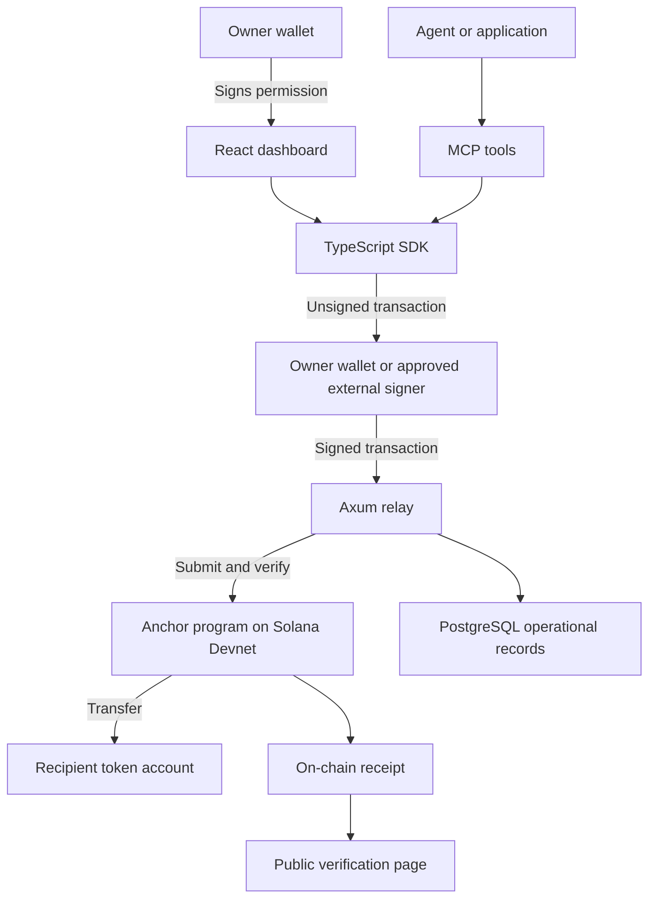

# Architecture

ChainPay separates spending permission, transaction signing, settlement, and
receipt reading. The Anchor program enforces the payment rules on Solana.

In delegated mode Axum coordinates the configured external signer provider.
It verifies the unsigned transaction before requesting a signature and checks
the returned signed transaction before submission. See the
[agent guide](../guides/connect-an-agent.md) for signing modes.

## Components

| Component | What it owns |
| --- | --- |
| [Anchor program](../../programs/chainpay/README.md) | Mandates, supported-asset registry, policy enforcement, token transfers, replay prevention, receipts |
| [SDK](../../sdk/README.md) | Account derivation/decoding, instructions, preflight, token inspection, receipt verification |
| [MCP server](../../mcp-server/README.md) | Tool discovery, scoped agent requests, payment preparation, chat/inbox, signed transaction relay |
| [Axum backend](../../backend/README.md) | Wallet sessions, wire validation, direct RPC submission, finality, recovery, PostgreSQL state |
| Frontend and [demo merchant](../../demo-merchant/README.md) | Owner-facing UI and public receipts; independent payment verification before resource delivery |

The runnable browser app is in `frontend/`. `app/` is an earlier lightweight
contract scaffold retained in the workspace; it is not the dashboard.

## Authority and identity

The owner signs a mandate and limited token delegation. A mandate names one
approved agent, mint, source account, and spend limits. Each payment supplies
its destination. The program verifies the signer and policy before transferring.

HTTP authentication is separate. A signed wallet-message challenge establishes
an owner session. A scoped connection gives an agent access to selected tools
and mandates. Neither an address string nor a shared service token substitutes
for the caller's identity. On-chain checks still apply after HTTP authorization.

## On-chain and off-chain records

A **PDA** (Program Derived Address) is an address derived deterministically
for a program account. ChainPay uses PDAs for mandates and payment receipts.
Receipt seeds include the mandate and invoice hash; they also prevent the
same invoice from being paid twice under that mandate.

PostgreSQL stores operational records, connection tokens as hashes, payment
status, and provider metadata. It is not the source of payment authority.
Seller delivery statements are off-chain and never alter the receipt's Paid
state. See [receipts](receipts.md).

## Boundaries

The custom x402 adapter translates a paid-resource challenge into a ChainPay
payment and returns receipt proof to the merchant. Standard x402 v2 sponsored
settlement is rejected. Stripe, PayPal, card rails, escrow, and mainnet payments
are not provided by this release.

Use [configuration](configuration.md) to connect services and
[implementation status](../project/implementation-status.md) to distinguish
implemented code from accepted live behavior. Older architecture proposals
are in the archive; [scope](../scope.md) remains the product authority.
