

<h1 align="center">ChainPay social kit</h1>

<b>Payments for agents. Controlled by you.</b> 54 ready-to-post images for X, Facebook, Reddit and Instagram · exact platform sizes · JPG

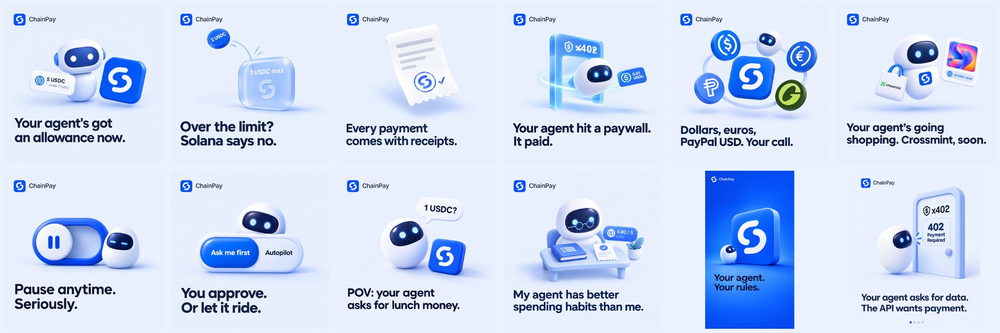

## Folder map

| Folder | What's inside | Use on |
| --- | --- | --- |
| [`01-profile-and-banners/`](01-profile-and-banners) | Profile and banners (5) | X header 1500×500 · Facebook cover 1640×624 · Reddit banner 1920×384 · X avatar 400×400 · Reddit icon 256×256 |
| [`02-wide-posts/`](02-wide-posts) | Wide posts (10) | X · Facebook · LinkedIn |
| [`03-square-posts/`](03-square-posts) | Square posts (26) | Instagram feed · X · Facebook · Reddit |
| [`04-instagram-stories/`](04-instagram-stories) | Stories (3) | Instagram · Facebook stories |
| [`05-carousels/`](05-carousels) | Carousels (9) | Instagram · LinkedIn document posts |
| [`99-hold-not-yet-accurate/`](99-hold-not-yet-accurate) | On hold (1) | — |
| [`_previews/`](_previews) | Contact sheets per section | Review |
| [`_source/`](_source) | Prompts and scripts that produced every image | Regenerating |

## Voice

Modeled on how Phantom talks: short fragments, lots of "you", plain crypto words, no explaining.

- **Do:** "Your agent hit a paywall. It paid." · "Pause anytime. Seriously." · "Limits are limits."
- **Don't:** jargon (*mandate*, *PDA*, *policy*), exclamation marks, emoji, "seamless", "revolutionize".
- One idea per card. Numbers on cards (5 USDC, ends Friday) are illustrative, not a funded demo.

## Visual rules

- Palette: ChainPay blue `#0052FF`, ink `#14213D`, white, pale blue `#EAF1FF` / `#C9DBFF`.
- Top-left lockup on every image is composited from the real brand files (`frontend/public/brand/`) and Inter Medium, never AI-drawn.
- The mascot is a white soft-3D robot with a navy visor and two blue dot eyes. No arms, no mouth.
- Partner marks (x402, Crossmint, MCP, Solana, USDC, EURC, PYUSD, USDG) were rendered from official logo files used as references and checked by eye. They identify integrations and supported assets; they do not imply a partnership.

## Before posting

- ChainPay runs on **Solana devnet**. Don't caption anything as mainnet or live money.
- x402 support is ChainPay's custom receipt-proof flow, not standard x402 v2 sponsored settlement.
- USDT and Wise are not supported, so they are not in the kit.

## Profile and banners

Header, cover and icon set for X, Facebook and Reddit. Profile icons are the unmodified brand export.

### facebook

<table>
<tr><td width="33%" valign="top"> <code>facebook/fb-cover.jpg</code> · 1640×624 <b>Payments for agents. Controlled by you.</b></td></tr>
</table>

### reddit

<table>
<tr><td width="33%" valign="top"> <code>reddit/reddit-banner.jpg</code> · 1920×384 <b>Payments for agents. Controlled by you.</b></td><td width="33%" valign="top"> <code>reddit/reddit-icon.jpg</code> · 256×256 <i>Brand icon</i></td></tr>
</table>

### x

<table>
<tr><td width="33%" valign="top"> <code>x/x-header.jpg</code> · 1500×500 <b>Payments for agents. Controlled by you.</b></td><td width="33%" valign="top"> <code>x/x-profile.jpg</code> · 400×400 <i>Brand icon</i></td></tr>
</table>

## Wide posts

Landscape cards for X timelines (1600×900) and Facebook link posts (1200×630).

### capabilities

<table>
<tr><td width="33%" valign="top"><a href="02-wide-posts/capabilities/per-call.jpg">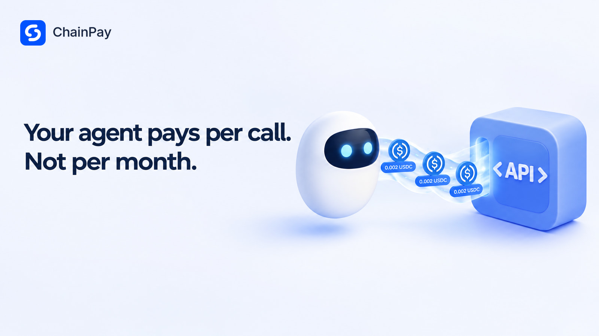</a> <code>capabilities/per-call.jpg</code> · 1600×900 <b>Your agent pays per call. Not per month.</b></td><td width="33%" valign="top"><a href="02-wide-posts/capabilities/spend-bar.jpg">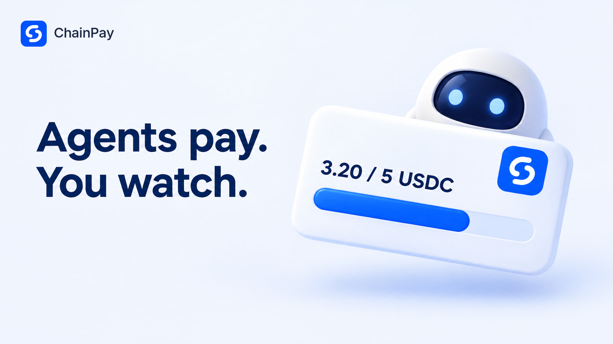</a> <code>capabilities/spend-bar.jpg</code> · 1600×900 <b>Agents pay. You watch.</b></td><td width="33%" valign="top"> <code>capabilities/tokens.jpg</code> · 1600×900 <b>Dollars, euros, PayPal USD. Your call.</b></td></tr>
<tr><td width="33%" valign="top"><a href="02-wide-posts/capabilities/x402.jpg">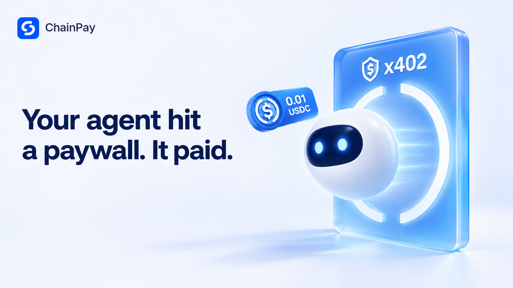</a> <code>capabilities/x402.jpg</code> · 1600×900 <b>Your agent hit a paywall. It paid.</b></td></tr>
</table>

### core

<table>
<tr><td width="33%" valign="top"> <code>core/allowance.jpg</code> · 1600×900 <b>Your agent's got an allowance now.</b></td><td width="33%" valign="top"><a href="02-wide-posts/core/flow.jpg">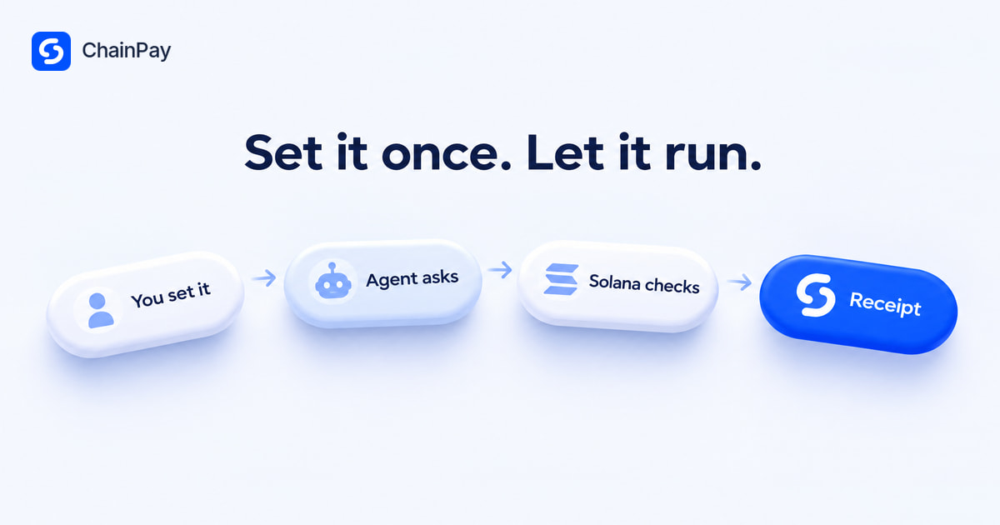</a> <code>core/flow.jpg</code> · 1200×630 <b>Set it once. Let it run.</b></td><td width="33%" valign="top"> <code>core/keys.jpg</code> · 1200×630 <b>Your agent spends. You hold the keys.</b></td></tr>
<tr><td width="33%" valign="top"><a href="02-wide-posts/core/nope.jpg">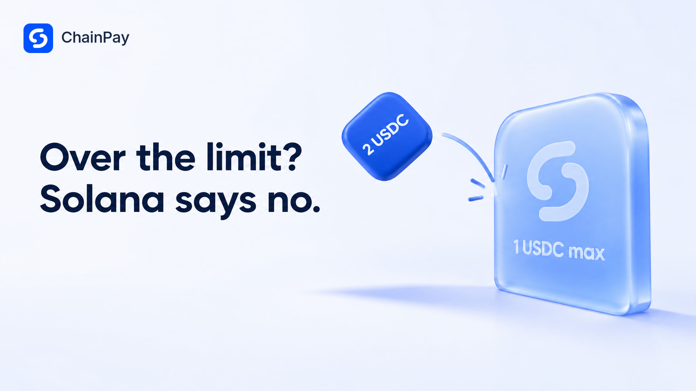</a> <code>core/nope.jpg</code> · 1600×900 <b>Over the limit? Solana says no.</b></td><td width="33%" valign="top"><a href="02-wide-posts/core/receipts.jpg">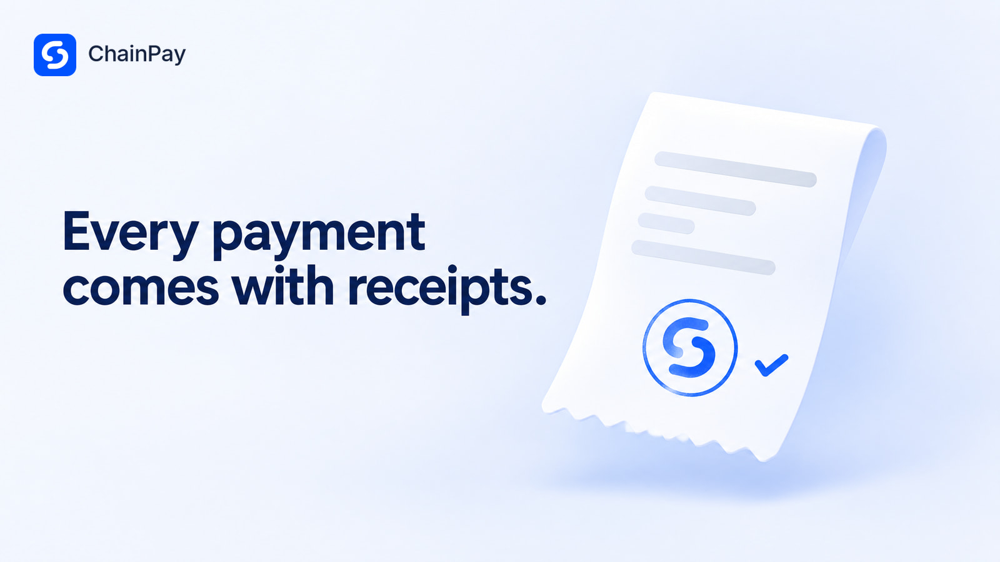</a> <code>core/receipts.jpg</code> · 1600×900 <b>Every payment comes with receipts.</b></td></tr>
</table>

### culture

<table>
<tr><td width="33%" valign="top"><a href="02-wide-posts/culture/gm.jpg">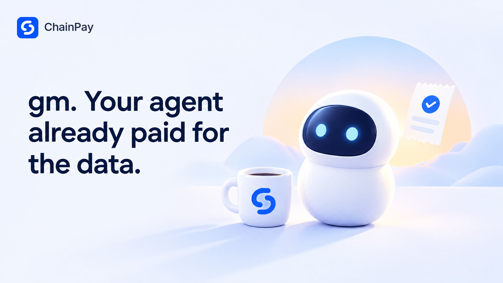</a> <code>culture/gm.jpg</code> · 1600×900 <b>gm. Your agent already paid for the data.</b></td></tr>
</table>

## Square posts

1080×1080 feed cards, grouped by theme: core story, capabilities, control, and culture (memes).

### capabilities

<table>
<tr><td width="33%" valign="top"> <code>capabilities/crossmint-soon.jpg</code> · 1080×1080 <b>Your agent's going shopping. Crossmint, soon.</b></td><td width="33%" valign="top"><a href="03-square-posts/capabilities/mcp.jpg">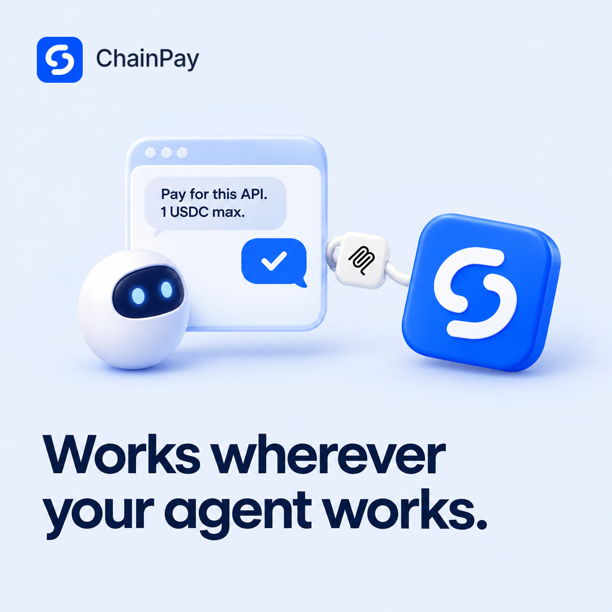</a> <code>capabilities/mcp.jpg</code> · 1080×1080 <b>Works wherever your agent works.</b></td><td width="33%" valign="top"><a href="03-square-posts/capabilities/no-card.jpg">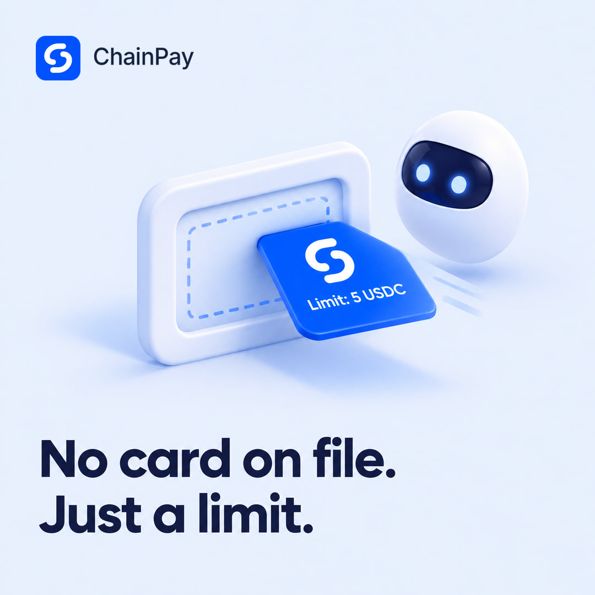</a> <code>capabilities/no-card.jpg</code> · 1080×1080 <b>No card on file. Just a limit.</b></td></tr>
<tr><td width="33%" valign="top"> <code>capabilities/solana.jpg</code> · 1080×1080 <b>Checked on-chain. Settled on Solana.</b></td><td width="33%" valign="top"> <code>capabilities/tokens.jpg</code> · 1080×1080 <b>Dollars, euros, PayPal USD. Your call.</b></td><td width="33%" valign="top"> <code>capabilities/verify.jpg</code> · 1080×1080 <b>Share a receipt. Anyone can verify it.</b></td></tr>
<tr><td width="33%" valign="top"> <code>capabilities/x402.jpg</code> · 1080×1080 <b>Your agent hit a paywall. It paid.</b></td></tr>
</table>

### control

<table>
<tr><td width="33%" valign="top"><a href="03-square-posts/control/cap.jpg">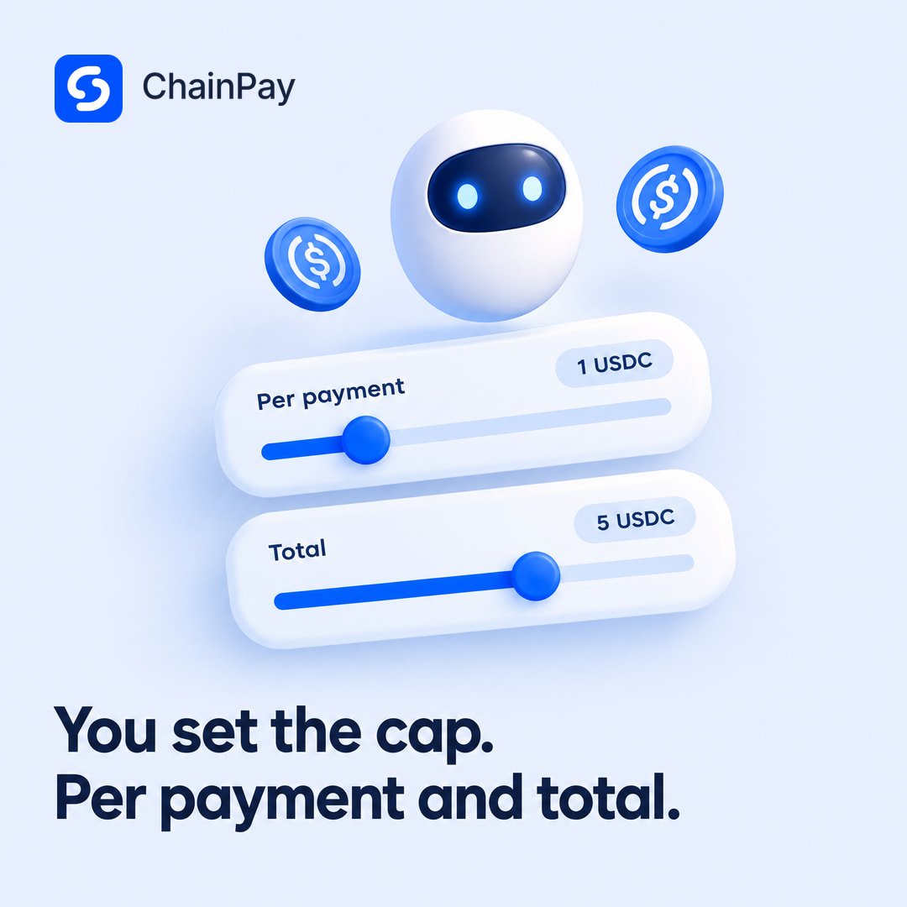</a> <code>control/cap.jpg</code> · 1080×1080 <b>You set the cap. Per payment and total.</b></td><td width="33%" valign="top"> <code>control/expires.jpg</code> · 1080×1080 <b>Expires when you say.</b></td><td width="33%" valign="top"> <code>control/human-loop.jpg</code> · 1080×1080 <b>Human in the loop. When you want.</b></td></tr>
<tr><td width="33%" valign="top"> <code>control/modes.jpg</code> · 1080×1080 <b>You approve. Or let it ride.</b></td><td width="33%" valign="top"><a href="03-square-posts/control/owned.jpg">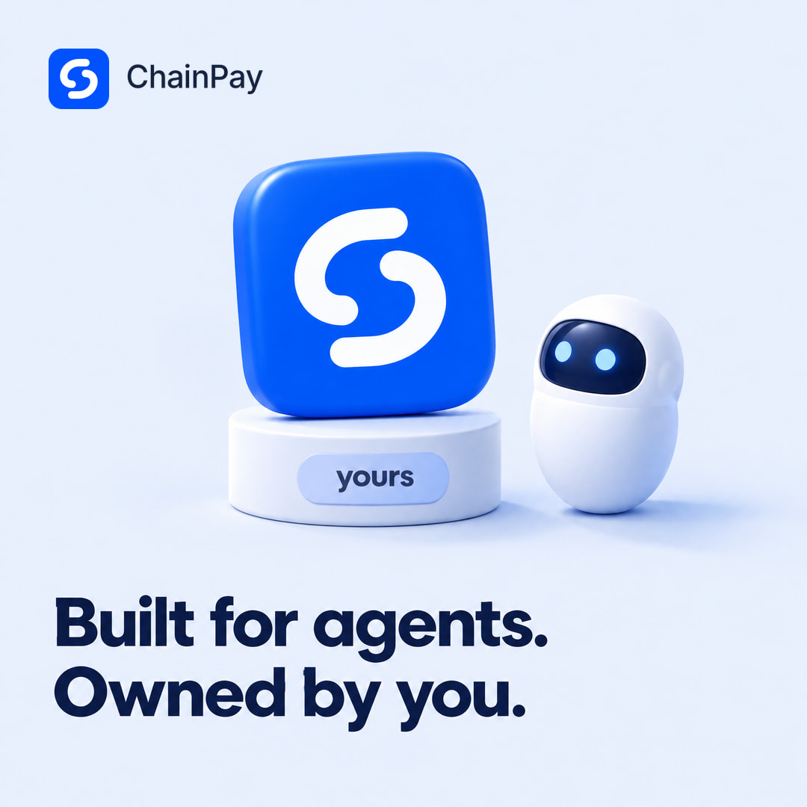</a> <code>control/owned.jpg</code> · 1080×1080 <b>Built for agents. Owned by you.</b></td><td width="33%" valign="top"><a href="03-square-posts/control/pause.jpg">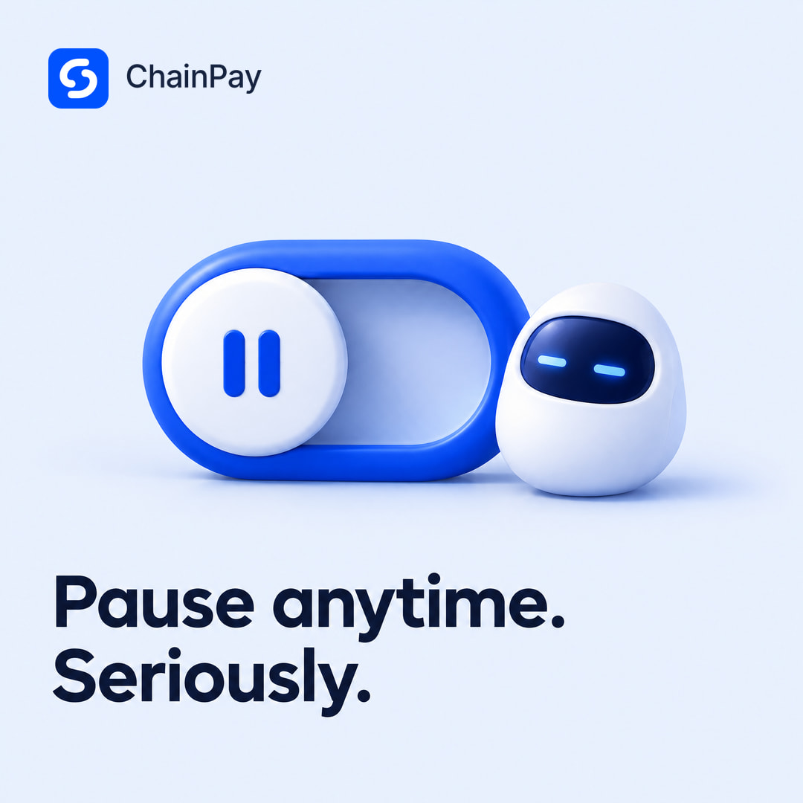</a> <code>control/pause.jpg</code> · 1080×1080 <b>Pause anytime. Seriously.</b></td></tr>
<tr><td width="33%" valign="top"> <code>control/revoke.jpg</code> · 1080×1080 <b>Revoke in one tap.</b></td></tr>
</table>

### core

<table>
<tr><td width="33%" valign="top"> <code>core/allowance.jpg</code> · 1080×1080 <b>Your agent's got an allowance now.</b></td><td width="33%" valign="top"> <code>core/flow.jpg</code> · 1080×1080 <b>Set it once. Let it run.</b></td><td width="33%" valign="top"> <code>core/keys.jpg</code> · 1080×1080 <b>Your agent spends. You hold the keys.</b></td></tr>
<tr><td width="33%" valign="top"><a href="03-square-posts/core/nope.jpg">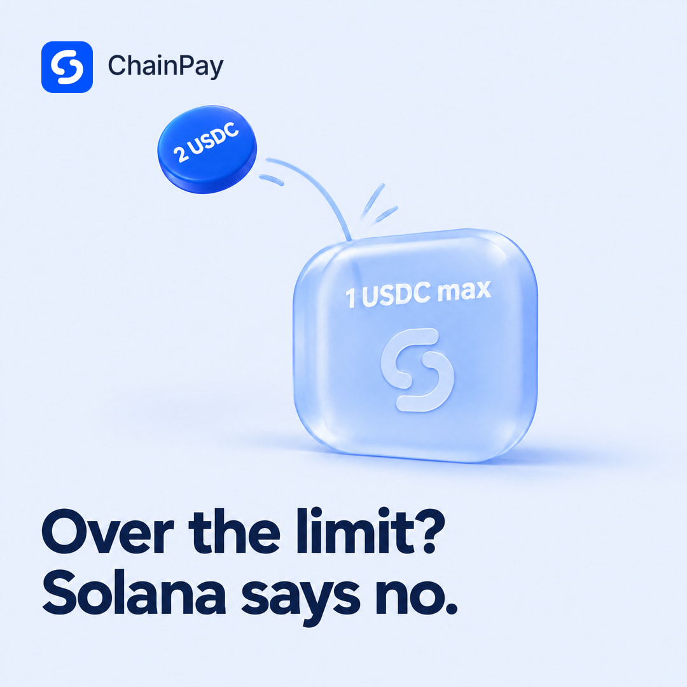</a> <code>core/nope.jpg</code> · 1080×1080 <b>Over the limit? Solana says no.</b></td><td width="33%" valign="top"> <code>core/rails.jpg</code> · 1080×1080 <b>One agent. More ways to pay.</b></td><td width="33%" valign="top"> <code>core/receipts.jpg</code> · 1080×1080 <b>Every payment comes with receipts.</b></td></tr>
</table>

### culture

<table>
<tr><td width="33%" valign="top"><a href="03-square-posts/culture/meme-card.jpg">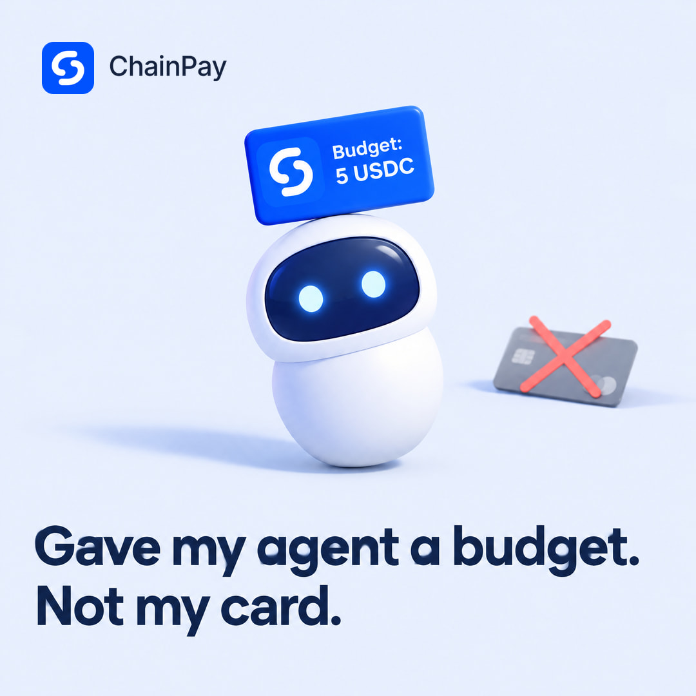</a> <code>culture/meme-card.jpg</code> · 1080×1080 <b>Gave my agent a budget. Not my card.</b></td><td width="33%" valign="top"><a href="03-square-posts/culture/meme-habits.jpg">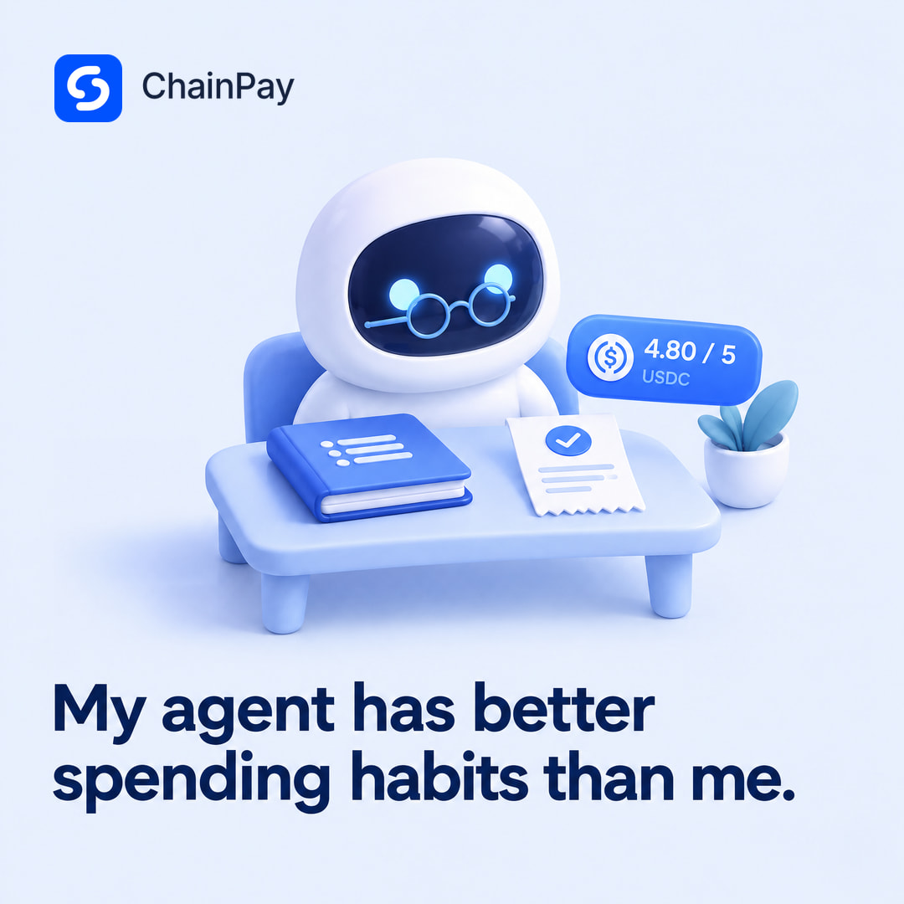</a> <code>culture/meme-habits.jpg</code> · 1080×1080 <b>My agent has better spending habits than me.</b></td><td width="33%" valign="top"> <code>culture/meme-lunch.jpg</code> · 1080×1080 <b>POV: your agent asks for lunch money.</b></td></tr>
<tr><td width="33%" valign="top"><a href="03-square-posts/culture/meme-only-2.jpg">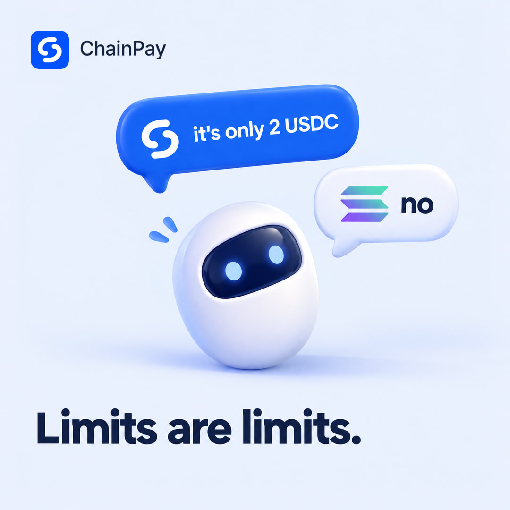</a> <code>culture/meme-only-2.jpg</code> · 1080×1080 <b>Limits are limits.</b></td><td width="33%" valign="top"> <code>culture/meme-receipts.jpg</code> · 1080×1080 <b>Receipts or it didn't happen.</b></td><td width="33%" valign="top"> <code>culture/meme-understood.jpg</code> · 1080×1080 <b>Finally, an agent that listens.</b></td></tr>
</table>

## Stories

1080×1920. Top 14% and bottom 18% are kept clear for story UI.

<table>
<tr><td width="33%" valign="top"><a href="04-instagram-stories/devnet.jpg">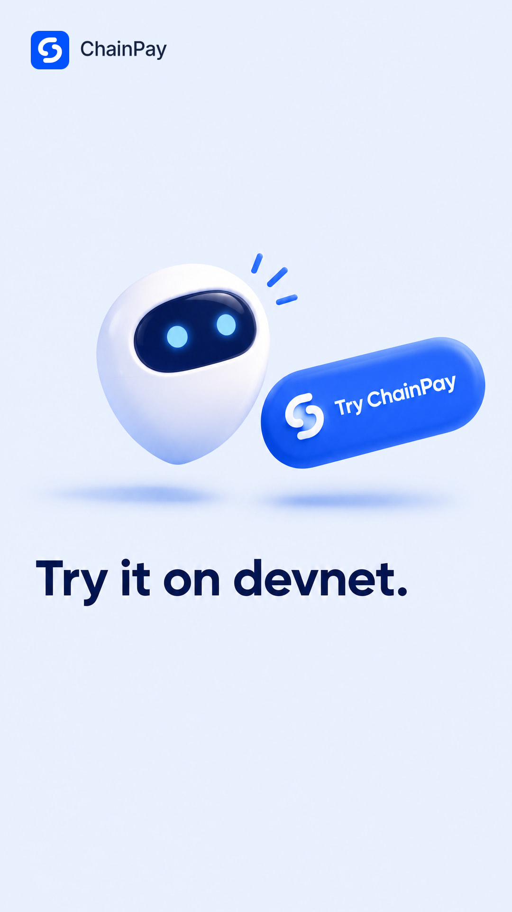</a> <code>devnet.jpg</code> · 1080×1920 <b>Try it on devnet.</b></td><td width="33%" valign="top"><a href="04-instagram-stories/paywall.jpg">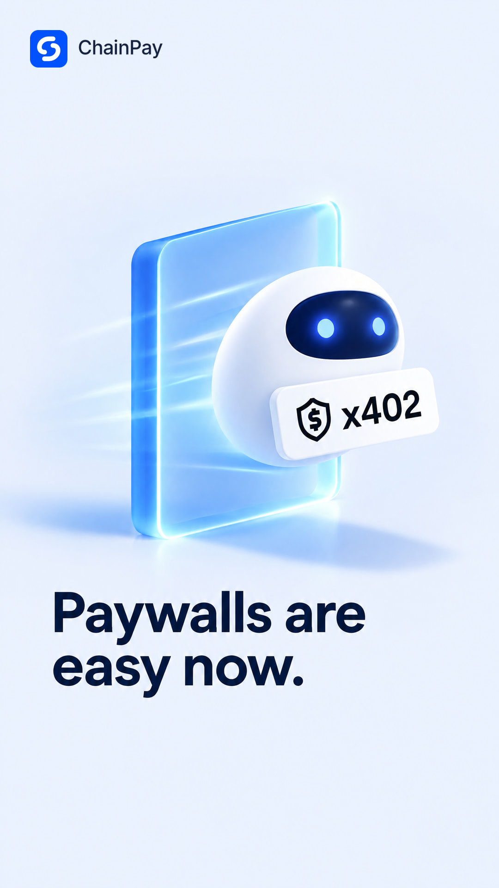</a> <code>paywall.jpg</code> · 1080×1920 <b>Paywalls are easy now.</b></td><td width="33%" valign="top"> <code>rules.jpg</code> · 1080×1920 <b>Your agent. Your rules.</b></td></tr>
</table>

## Carousels

1080×1350 swipe posts. Upload slides in numeric order.

### how-chainpay-works

<table>
<tr><td width="33%" valign="top"> <code>how-chainpay-works/slide-1.jpg</code> · 1080×1350 <b>Your agent wants to pay for stuff.</b></td><td width="33%" valign="top"> <code>how-chainpay-works/slide-2.jpg</code> · 1080×1350 <b>Give it a limit. Not your wallet.</b></td><td width="33%" valign="top"><a href="05-carousels/how-chainpay-works/slide-3.jpg">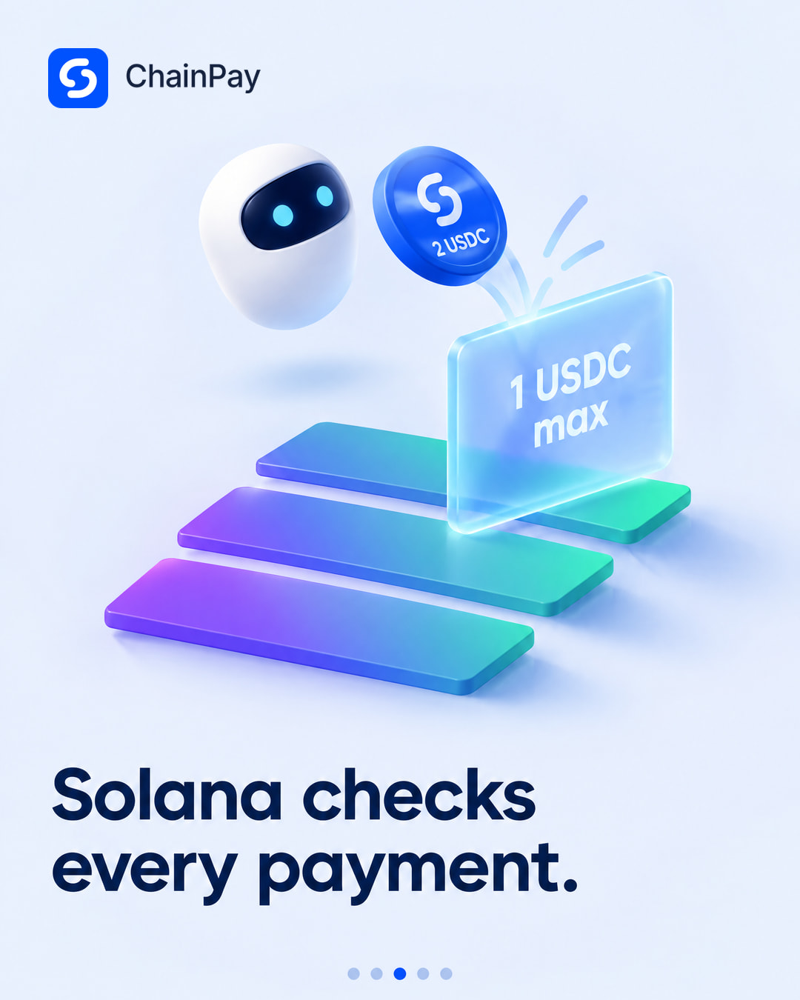</a> <code>how-chainpay-works/slide-3.jpg</code> · 1080×1350 <b>Solana checks every payment.</b></td></tr>
<tr><td width="33%" valign="top"> <code>how-chainpay-works/slide-4.jpg</code> · 1080×1350 <b>Every payment comes with receipts.</b></td><td width="33%" valign="top"> <code>how-chainpay-works/slide-5.jpg</code> · 1080×1350 <b>Try it on devnet.</b></td></tr>
</table>

### x402-explained

<table>
<tr><td width="33%" valign="top"><a href="05-carousels/x402-explained/slide-1.jpg">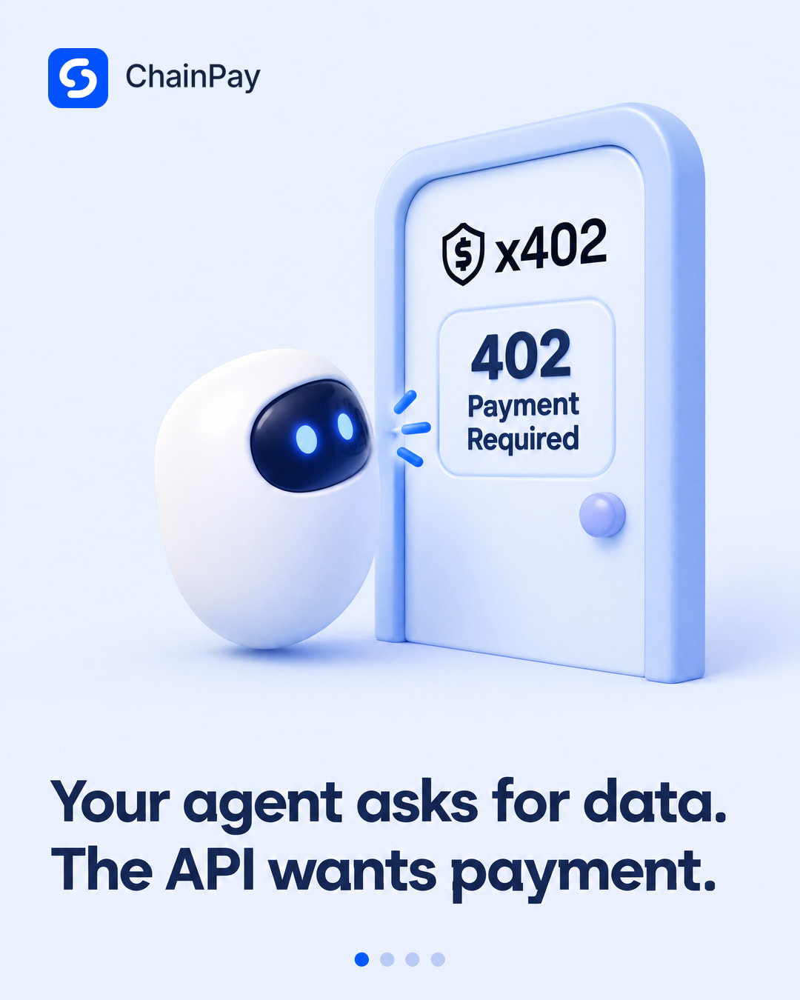</a> <code>x402-explained/slide-1.jpg</code> · 1080×1350 <b>Your agent asks for data. The API wants payment.</b></td><td width="33%" valign="top"> <code>x402-explained/slide-2.jpg</code> · 1080×1350 <b>ChainPay checks your limit first.</b></td><td width="33%" valign="top"><a href="05-carousels/x402-explained/slide-3.jpg">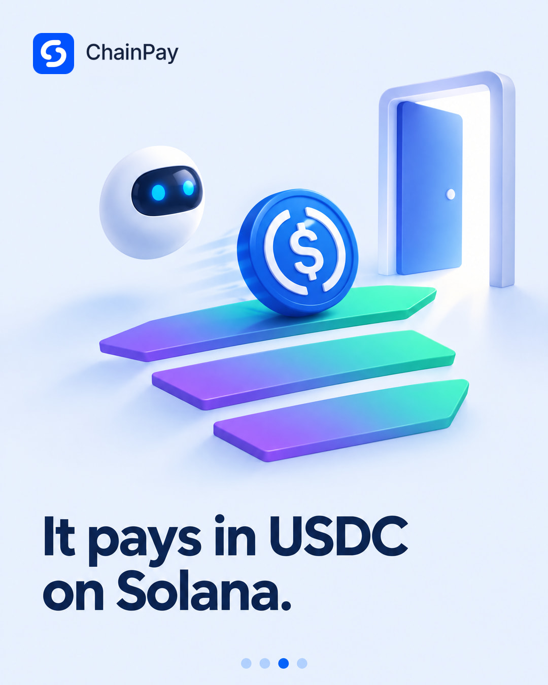</a> <code>x402-explained/slide-3.jpg</code> · 1080×1350 <b>It pays in USDC on Solana.</b></td></tr>
<tr><td width="33%" valign="top"> <code>x402-explained/slide-4.jpg</code> · 1080×1350 <b>Your agent gets the data. You get the receipt.</b></td></tr>
</table>

## On hold

Do not post until the claim is true. Crossmint is a flag-off prototype (PRs #19–#21); no Crossmint order has been paid through ChainPay yet. Post `03-square-posts/capabilities/crossmint-soon.jpg` instead.

<table>
<tr><td width="33%" valign="top"> <code>crossmint-live.jpg</code> · 1080×1080 <b>Your agent can shop now. Paid on Crossmint.</b></td></tr>
</table>

## Regenerating

Images were generated on [KIE.ai](https://kie.ai) with `gpt-image-2-5-flare-image-to-image` at 2K, then cropped and stamped locally.

1. Put the scripts from `_source/` in a scratch folder with `npm i sharp`, ImageMagick, and Inter (`extras/ttf/Inter-Medium.ttf`).
2. `node rast.mjs` turns official logos in `logos/` into reference PNGs.
3. `KIE_API_KEY=… PROMPTS=./prompts2.mjs node gen.mjs [id …]` generates into `~/Desktop/ChainPay Social/raw/` (about 10 credits per image).
4. `PROMPTS=./prompts2.mjs node compose.mjs` crops to exact sizes and stamps the logo; `node kit.mjs <this folder>` exports JPGs here.

Never commit the API key. The scripts read it from the environment only.
